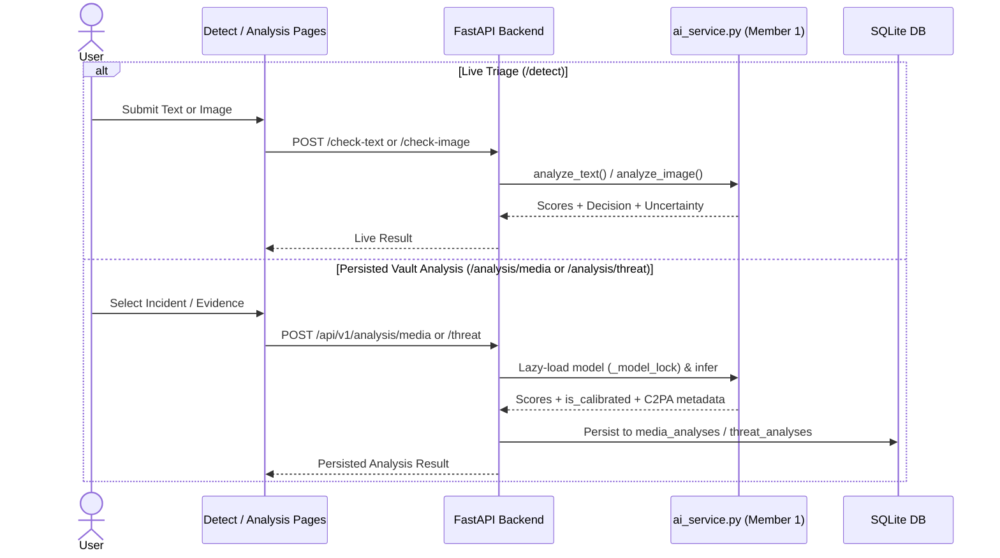

# AI Analysis Workflow

```mermaid
sequenceDiagram
  actor User
  participant UI as Detect / Analysis Pages
  participant API as FastAPI Backend
  participant AI as ai_service.py (Member 1)
  participant DB as SQLite DB

  alt Live Triage (/detect)
    User->>UI: Submit Text or Image
    UI->>API: POST /check-text or /check-image
    API->>AI: analyze_text() / analyze_image()
    AI-->>API: Scores + Decision + Uncertainty
    API-->>UI: Live Result
  else Persisted Vault Analysis (/analysis/media or /analysis/threat)
    User->>UI: Select Incident / Evidence
    UI->>API: POST /api/v1/analysis/media or /threat
    API->>AI: Lazy-load model (_model_lock) & infer
    AI-->>API: Scores + is_calibrated + C2PA metadata
    API->>DB: Persist to media_analyses / threat_analyses
    API-->>UI: Persisted Analysis Result
  end
```
