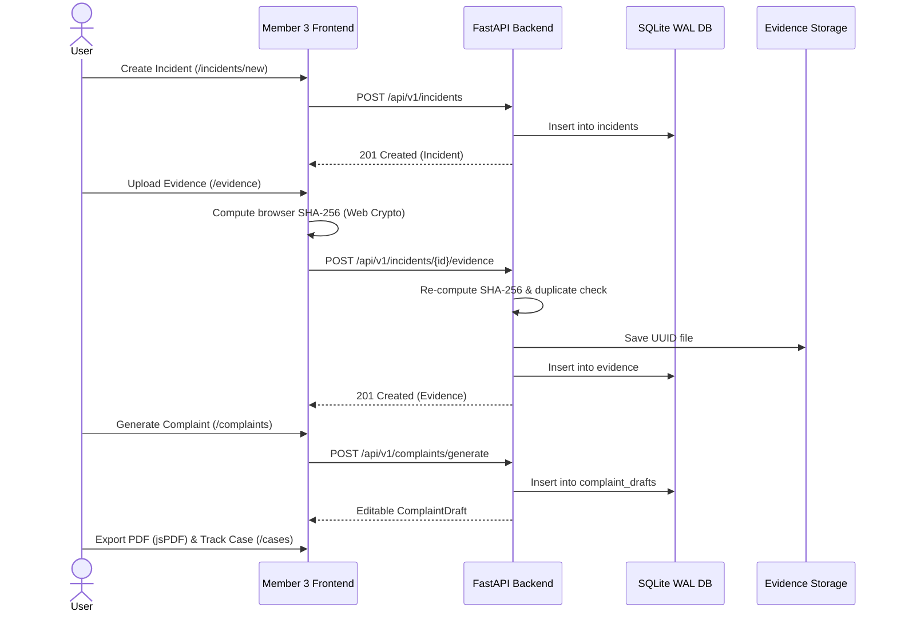

# Incident-to-Complaint End-to-End Workflow

```mermaid
sequenceDiagram
  actor User
  participant UI as Member 3 Frontend
  participant API as FastAPI Backend
  participant DB as SQLite WAL DB
  participant Vault as Evidence Storage

  User->>UI: Create Incident (/incidents/new)
  UI->>API: POST /api/v1/incidents
  API->>DB: Insert into incidents
  API-->>UI: 201 Created (Incident)

  User->>UI: Upload Evidence (/evidence)
  UI->>UI: Compute browser SHA-256 (Web Crypto)
  UI->>API: POST /api/v1/incidents/{id}/evidence
  API->>API: Re-compute SHA-256 & duplicate check
  API->>Vault: Save UUID file
  API->>DB: Insert into evidence
  API-->>UI: 201 Created (Evidence)

  User->>UI: Generate Complaint (/complaints)
  UI->>API: POST /api/v1/complaints/generate
  API->>DB: Insert into complaint_drafts
  API-->>UI: Editable ComplaintDraft
  User->>UI: Export PDF (jsPDF) & Track Case (/cases)
```
